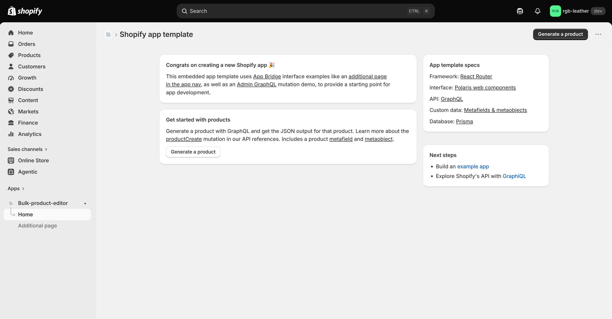
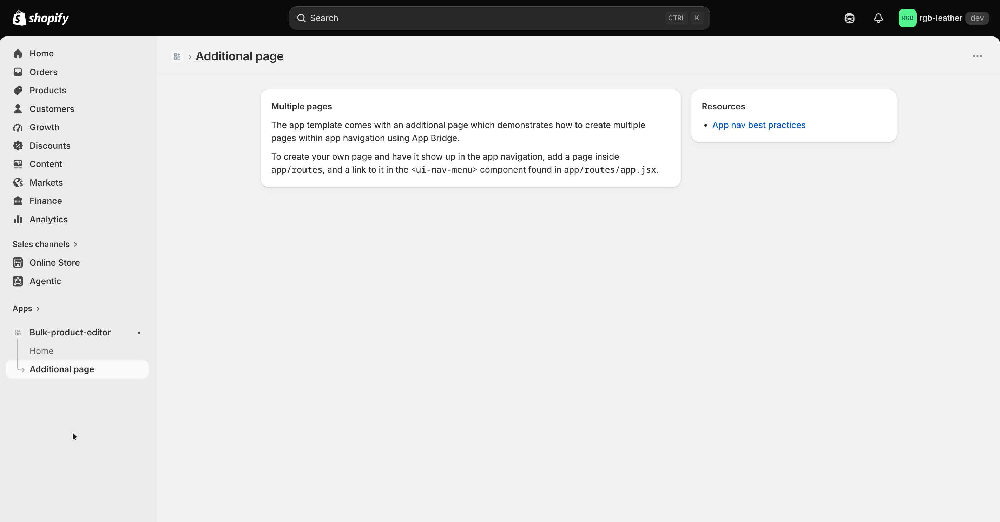

# Bulk Product Editor

An embedded Shopify app for changing prices, tags, collections, titles, descriptions, vendor,
type and status on hundreds of products at once, from a rule builder or a spreadsheet. Every
change is previewed before it's written and can be undone in one click.


*The app installed in the `rgb-leather` dev store, showing the starter template's home page.*

## What it does

Editing products one by one in the Shopify admin is slow and error-prone when a sale, a
re-price or a catalog cleanup touches hundreds of them. This app lets a merchant describe the
change once, either as rules ("everything from vendor X: −20 %, round to .99, add tag `sale`")
or as a CSV/Excel file. It shows the exact before → after value of every field it will touch,
applies the changes through Shopify's Bulk Operations API with live progress, and keeps the
original values so the whole job can be reversed.

## How to use it

1. Open the app. **Dashboard** shows jobs run, products updated, field changes, estimated time
   saved and recent jobs.
2. Click **New bulk edit**. Under **1. Choose products**, pick **All products matching a
   filter** (search, status, collection, vendor, product type, tag, with a live match count) or
   **Products I pick** → **Select products**.
3. Set the changes you want in **2. Prices**, **3. Tags and collections**, **4. Title and
   description** and **5. Organization**, give the job a name under **Summary**, then click
   **Preview changes**.
   - Or use **Import CSV**: click **Download template** (or use a Shopify product export),
     upload the file, check the parsed rows and warnings, and click **Preview changes**.
4. On the job page, review every before → after value and any warnings. Click **Refresh
   preview** if it's more than 30 minutes old, or **Discard** to drop it.
5. Click **Apply to N products** and watch the progress bar. The job finishes even if you close
   the tab.
6. To reverse a finished job, open it from **History** and click **Undo this job**.

## Features

- **Dashboard**: totals for the last 7, 30 or 90 days and a list of recent jobs.
- **Bulk edit**: a rule builder with these options:
  - **Price**: set, increase or decrease by % or by amount, with rounding to .99, .95 or a
    whole number.
  - **Compare-at price**: set, remove, use the current price (to mark items on sale), or set a
    % above the new price.
  - **Tags**: add or remove.
  - **Collections**: add products to or remove them from collections.
  - **Title**: find and replace, add a prefix or add a suffix.
  - **Description**: find and replace, add to the start or end, or replace entirely.
  - **Organization**: set the vendor, product type and status.
- **Import CSV**: CSV, TSV or Excel files. Rows are matched by Handle, Variant SKU or ID, and
  Shopify export column names are accepted. Columns: Title, Body (HTML), Vendor, Type, Status,
  Tags (replaces all), Tags Add, Tags Remove, Variant Price, Variant Compare At Price (write
  `clear` to remove). Warnings are shown per row.
- **Job preview**: before → after for every changed field, plus warnings, a stale-preview
  banner, and Refresh or Discard.
- **Live apply**: shows progress and the updated/failed count for each product, with a final
  status of Completed, Partial or Failed.
- **Undo**: creates a new job that restores the saved original values, collection membership
  included.
- **History**: a list of every job, covering bulk edits, CSV imports and undos.

Limits: 10,000 products per rule-based job, 20,000 rows per import, and one job applying at a
time per shop.

## How it works

- **Snapshot**: `bulkOperationRunQuery` reads the selected products, variants and collection
  membership as JSONL, so there's no query-cost limit to work around. Imports snapshot the whole
  catalog and match rows in memory.
- **Plan**: rules or rows become a target state per product. Only real differences are kept,
  each with its exact `before` and `after`.
- **Price math**: prices are calculated in cents. % changes are `round(cents × (1 ± p/100))`,
  floored at 0. Rounding moves to the nearest .99 or .95 ending (ties go down, so 40.00 → 39.99
  and 21.40 → 20.99) or to the nearest whole number. "% above" sets compare-at to
  `new price × (1 + p/100)`.
- **Apply**: changes are staged as JSONL and run with `bulkOperationRunMutation`, first for
  `productUpdate` and then for `productVariantsBulkUpdate`. Collection changes go through
  `collectionUpdate` selections, 250 per call. Result lines map back to products by line number.
- **Progress**: there's no background worker. A job advances when the job page polls (every 2 s)
  and when the `bulk_operations/finish` webhook arrives. A row lock stops both from starting the
  same step.
- **Undo**: swaps each item's `before` and `after` and runs it through the same pipeline.
- **Time saved**: an estimate of 30 seconds per field change if done by hand.

## Screenshots

| Template additional page |
| --- |
|  |
| The starter template's additional page in the app nav. |

## Tech stack

React Router 7 with Polaris web components and App Bridge, Prisma (SQLite), Admin GraphQL API
`2026-07`, scopes `read_products,write_products`.

## Run locally

Requires Node ≥ 22.12 and the Shopify CLI.

```sh
npm install
npm run setup   # prisma generate + migrate
npm run dev     # shopify app dev
npm test        # unit tests and a full job lifecycle test against a fake Admin API
```

`npm run dev` sets `SHOPIFY_API_KEY`, `SHOPIFY_API_SECRET`, `SHOPIFY_APP_URL` and `SCOPES` for
you. Optional overrides:

| Variable | Purpose |
| --- | --- |
| `SHOP_CUSTOM_DOMAIN` | Allow a custom shop domain in addition to `*.myshopify.com` |
| `PORT` | App server port (default `3000`) |
| `FRONTEND_PORT` | HMR port (default `8002`) |
